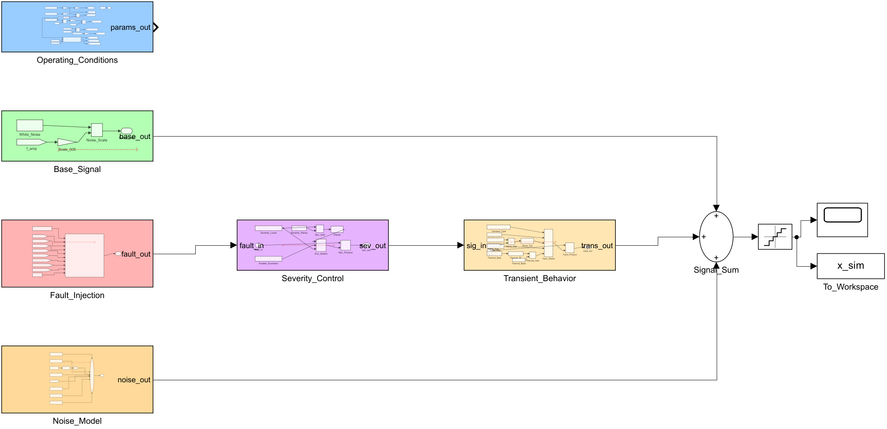
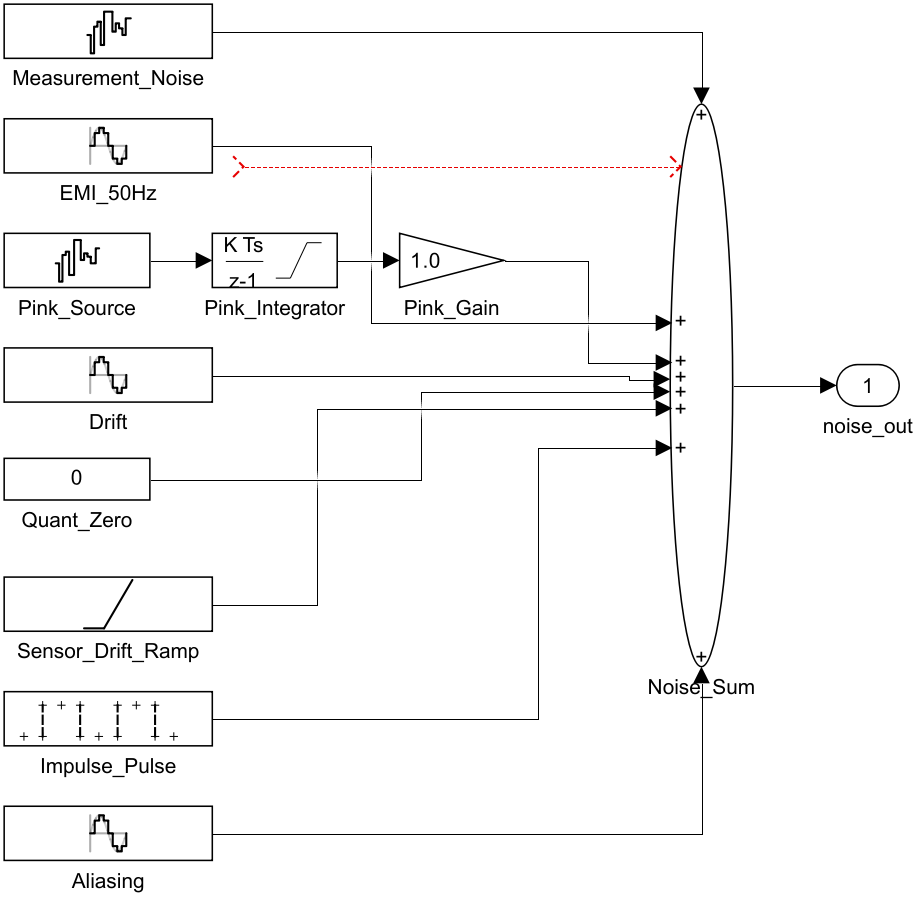
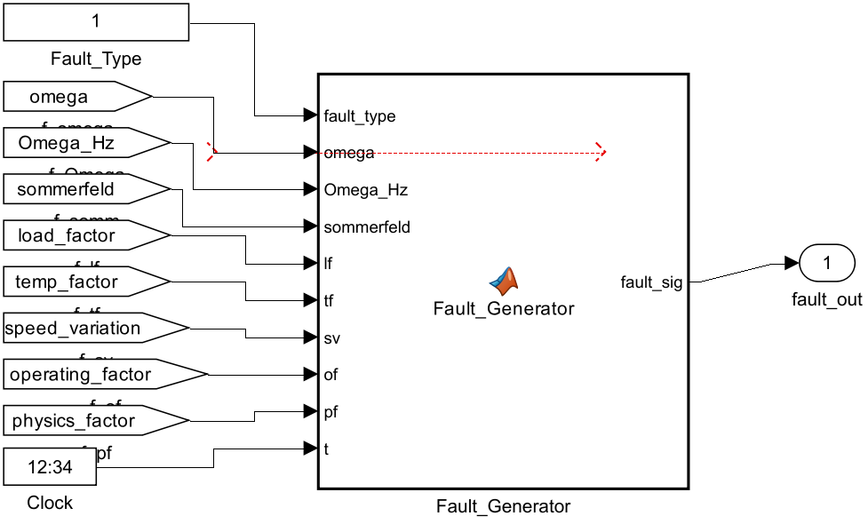
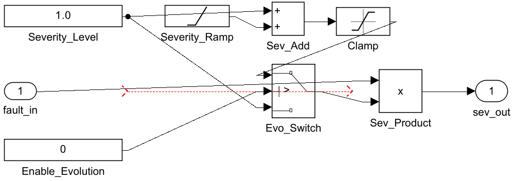
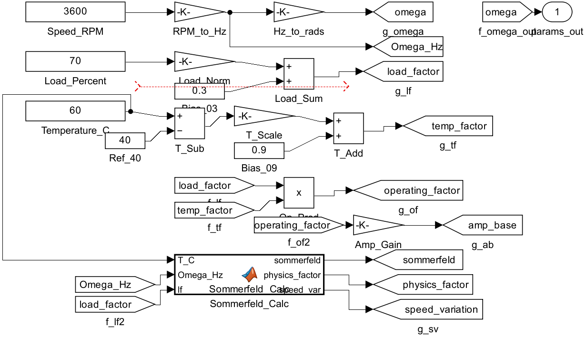
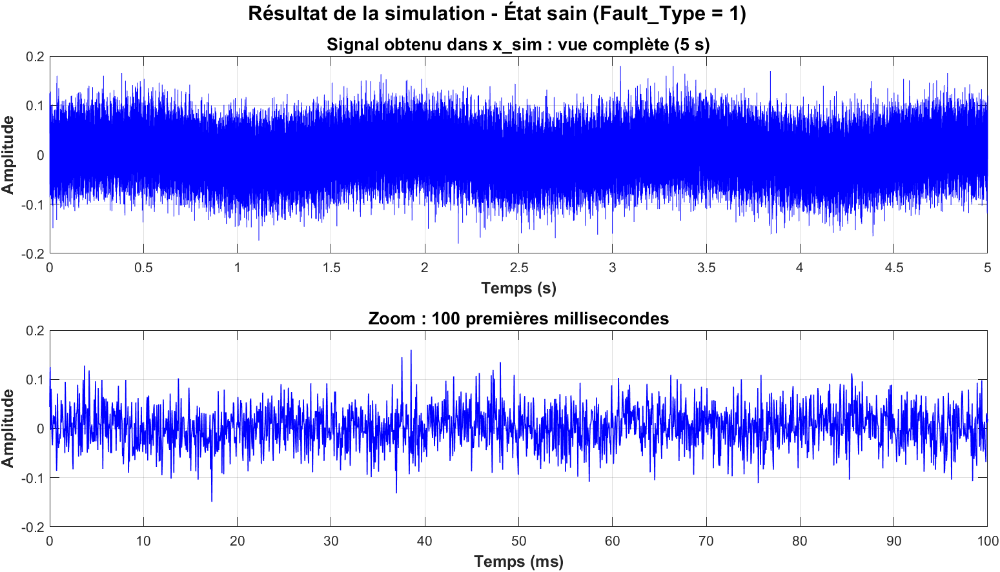

# Production du signal sain à partir du modèle Simulink

Ce document explique, étape par étape, comment le signal de référence de
l'état sain (`sain_001.mat`) est produit par le modèle Simulink
`PFD_Signal_Generator`. Deux méthodes sont possibles : par l'interface
Simulink (méthode A) ou par script (méthode B). Les deux produisent
exactement les mêmes échantillons de signal (simulation déterministe) ;
la méthode B produit en plus les métadonnées complètes et constitue la
référence du livrable.

Prérequis : MATLAB R2024b avec Simulink, Signal Processing Toolbox,
Statistics and Machine Learning Toolbox et Wavelet Toolbox (pour la
partie CWT de l'analyse).

Les captures ci-dessous montrent le modèle **configuré pour l'état sain**
(Fault_Type = 1) ; elles se trouvent dans `screenshots_sain/`.

---

## 1. Ce que fait le modèle pour l'état sain

Vue d'ensemble du modèle :



| Sous-système | Rôle | Cas de l'état sain |
|---|---|---|
| Operating_Conditions (bleu) | Convertit vitesse, charge et température en paramètres physiques et calcule le nombre de Sommerfeld | 3600 tr/min, 70 %, 60 °C : facteur de charge 0.79, Sommerfeld S = 0.190 |
| Base_Signal (vert) | Bruit de base du palier en fonctionnement | Présent (amplitude faible) |
| Fault_Injection (rouge) | Génère la signature du défaut sélectionné par la constante Fault_Type (1 à 11) | **Fault_Type = 1 : sortie NULLE, aucun défaut** |
| Severity_Control (violet) | Multiplie la signature du défaut par la sévérité (0 à 1) | Sans effet pour l'état sain (le défaut est nul) ; réglée à 1.0 (nominal) pour la génération |
| Transient_Behavior (beige) | Applique un transitoire optionnel (rampe de vitesse, échelon de charge, thermique) | Transient_Type = 1 : aucun |
| Noise_Model (orange) | 7 sources de bruit de mesure réalistes | Présent : bruit capteur, interférence secteur 50 Hz, bruit rose, dérives, impulsions, repliement |

Détail du sous-système de bruit (les 7 sources sommées) :



Le signal final est la somme :

```
x = Base_Signal + (Défaut x Sévérité x Transitoire) + Bruits de mesure
```

puis une quantification (pas de 0.001) simule le convertisseur
analogique-numérique. Pour l'état sain, le terme central est nul : le
signal sain est donc le bruit de base plus les bruits de mesure. Dans le
cadre de ce modèle, c'est la signature d'une machine en bon état : un
plancher de bruit large bande, sans raie de rotation dominante ni
signature de défaut ; seuls les artefacts de mesure simulés (EMI 50 Hz,
dérives lentes) sont présents.

Paramètres de simulation : support temporel de 0 à 5 s, fréquence
d'échantillonnage 20 480 Hz, solveur à pas fixe (ode4), soit
102 401 échantillons.

---

## 2. Méthode A : par l'interface Simulink

1. Ouvrir MATLAB R2024b dans le dossier du projet.
2. Ouvrir le modèle : double-clic sur `PFD_Signal_Generator.slx`
   (ou `>> open_system('PFD_Signal_Generator')`).
3. Double-cliquer sur le sous-système rouge **Fault_Injection**, puis sur
   la constante **Fault_Type**, et mettre sa valeur à **1** (= Sain).
   Valider avec OK. La vue obtenue :

   

4. Dans **Severity_Control**, mettre la constante **Severity_Level** à
   **1.0** (valeur nominale utilisée pour la génération ; sans effet sur
   l'état sain puisque le défaut est nul) et vérifier
   Enable_Evolution = 0 :

   

5. (Facultatif, valeurs déjà par défaut) Vérifier dans
   **Operating_Conditions** : Speed_RPM = 3600, Load_Percent = 70,
   Temperature_C = 60. Dans **Transient_Behavior** : Transient_Type = 1
   (aucun).

   

6. Lancer la simulation : bouton vert **Run** de l'onglet SIMULATION
   (ou Ctrl+T). La simulation couvre 5 secondes de temps simulé.
7. Observer le signal dans le **Scope** (double-clic sur le bloc Scope).
   Le signal complet est disponible dans l'espace de travail MATLAB sous
   la variable **x_sim** (visible dans le panneau Workspace). Le tracé
   ci-dessous montre le contenu de `x_sim` obtenu par cette procédure,
   c'est ce que le Scope affiche :

   

8. (Facultatif) Sauvegarder ce signal manuel au format .mat. Utiliser un
   **nom distinct** pour ne pas écraser le fichier de référence
   `sain_001.mat` du livrable, qui contient les métadonnées complètes :

```matlab
x = x_sim(:);
fs = 20480;
fault = 'sain';
save(fullfile('data_signaux_simulink', 'sain_manuel_001.mat'), ...
    'x', 'fs', 'fault', '-v7.3');
```

Remarque : avec les paramètres ci-dessus, les échantillons de
`sain_manuel_001.mat` sont identiques à ceux de `sain_001.mat`
(simulation déterministe). La différence est que le fichier de référence
contient en plus la structure `metadata` (sévérité, facteur de charge,
nombre de Sommerfeld, version du générateur), produite par la méthode B.

## 3. Méthode B : par script (automatique, référence du livrable)

Le script `generate_simulink_signals.m` fait tout automatiquement :
il reconstruit le modèle, le configure pour chacun des 11 états (dont
l'état sain avec les paramètres ci-dessus), lance les 11 simulations et
sauvegarde les fichiers dans `data_signaux_simulink/` (dossier créé à
côté du script), avec les métadonnées complètes.

```matlab
>> generate_simulink_signals
```

Résultat : `data_signaux_simulink/sain_001.mat` (et les 10 signaux de
défauts). Chaque fichier contient :

- `x` : le signal vibratoire (102 401 échantillons, colonne)
- `fs` : la fréquence d'échantillonnage (20 480 Hz)
- `fault` : le nom de l'état (`'sain'`)
- `metadata` : les paramètres exacts du modèle lors de la génération

Pour l'état sain, les métadonnées enregistrent notamment :
sévérité nominale 1.0, facteur de charge 0.79, nombre de
Sommerfeld 0.1899, version du générateur Simulink_v3.1.

## 4. Utilisation comme référence d'analyse

Le signal sain sert de référence à tout le travail. Pour l'analyser :

```matlab
>> run('LiveScripts_Simulink/Analyse_Signal_01_Sain.m')
```

Ce script effectue les quatre familles d'analyse convenues (temporelle,
statistique, fréquentielle, temps-fréquence STFT + CWT), exporte les
figures en français (300 DPI) ainsi que le tableau des indicateurs
statistiques (CSV) dans `Figures_Simulink/Sain/`, et génère un texte
d'interprétation prêt à adapter pour le rapport.
